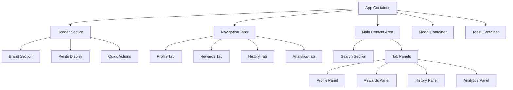
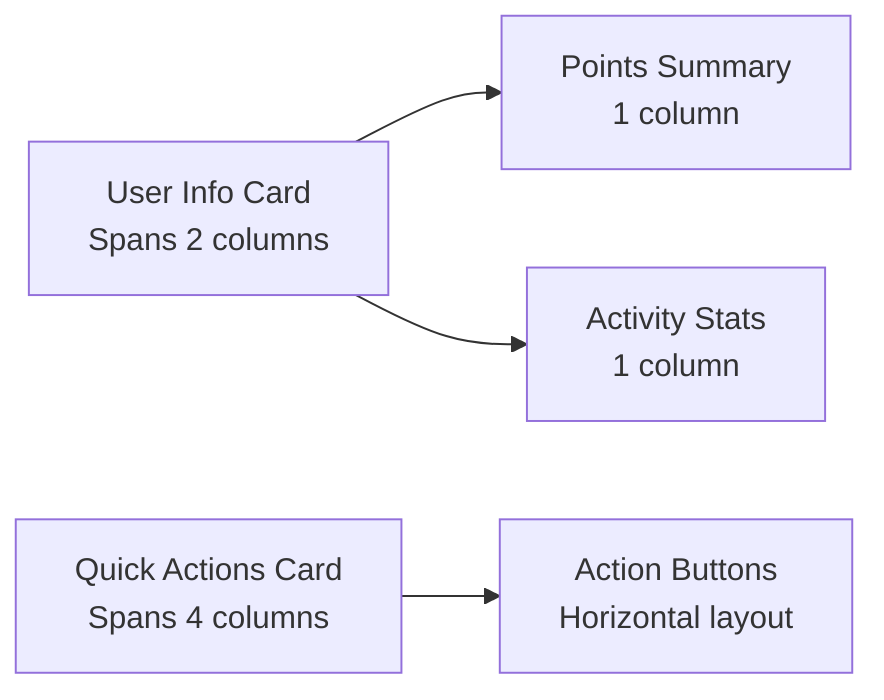
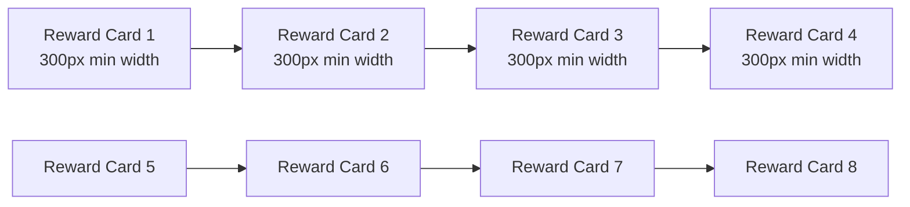
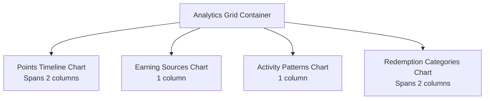
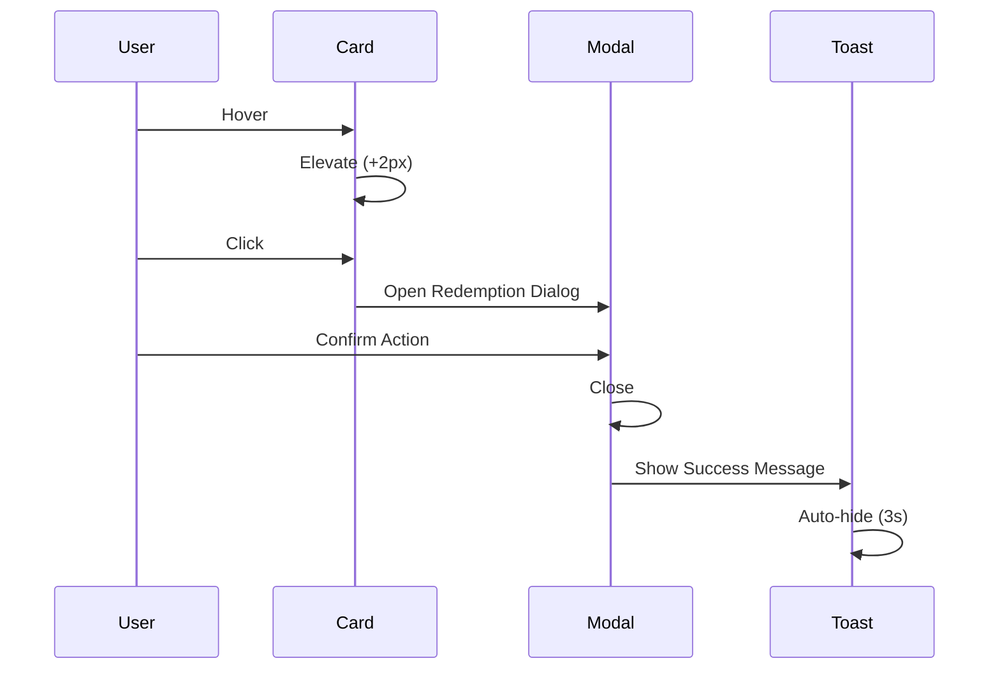
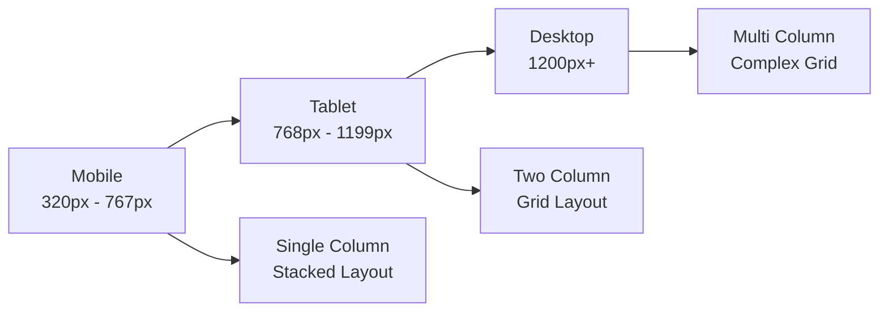

# 🎯 WayPoints Dashboard - Detailed Layout Diagrams & Component Specifications

## 📐 Application Layout Structure

### Overall Application Architecture


## 🖥️ Desktop Layout Specifications (1200px+)

### Header Component Breakdown
```
┌─────────────────────────────────────────────────────────────────────────────┐
│ ┌─────────────────────┐           ┌─────────────────┐ ┌─────────────────────┐ │
│ │ 🎯 WayPoints        │           │    1,250        │ │ 🎁 Redeem    ⚙️ 🌙 │ │
│ │ Dashboard           │           │  WayPoints      │ │                     │ │
│ │ Welcome back, Sarah │           │    [Gold]       │ │                     │ │
│ └─────────────────────┘           └─────────────────┘ └─────────────────────┘ │
│ Brand Section (33%)               Points Display      Quick Actions (25%)    │
└─────────────────────────────────────────────────────────────────────────────┘
```

**Header Dimensions:**
- **Height**: 80px (desktop), 64px (mobile)
- **Padding**: 16px horizontal, 12px vertical
- **Max Width**: 1200px centered
- **Background**: White (#FFFFFF) with subtle shadow

### Navigation Tab Structure
```
┌─────────────────────────────────────────────────────────────────────────────┐
│ ┌─────────────┐ ┌─────────────┐ ┌─────────────┐ ┌─────────────┐             │
│ │    👤       │ │    🎁       │ │    📊       │ │    📈       │             │
│ │  Profile    │ │  Rewards    │ │  History    │ │ Analytics   │             │
│ │ ═══════════  │ │             │ │             │ │             │             │
│ └─────────────┘ └─────────────┘ └─────────────┘ └─────────────┘             │
│ Active Tab      Inactive Tabs                                               │
└─────────────────────────────────────────────────────────────────────────────┘
```

**Tab Specifications:**
- **Width**: 25% each (desktop), flexible (mobile)
- **Height**: 60px
- **Active Indicator**: 2px blue underline
- **Hover Effect**: Background color change
- **Icon Size**: 20px
- **Label**: 12px uppercase, 500 weight

## 📱 Mobile Layout Specifications (320px - 767px)

### Compact Header Layout
```
┌─────────────────────────────────────┐
│ 🎯 WayPoints  1,250 WP    🎁 ⚙️ 🌙 │
│ Welcome, Sarah   [Gold]             │
└─────────────────────────────────────┘
```

### Stacked Tab Navigation
```
┌─────────────────────────────────────┐
│  👤     🎁     📊     📈           │
│Profile Rewards History Analytics    │
│ ═══                                 │
└─────────────────────────────────────┘
```

## 🏠 Profile Tab - Detailed Component Layout

### Desktop Grid System (4 Columns)


### Profile Card Components
```
┌─────────────────────────────────────────────────────────────────────────────┐
│                               Your Profile                                  │
│               Manage your account and view your WayPoints journey           │
│                                                                             │
│ ┌─────────────────────────────────┐ ┌─────────────┐ ┌─────────────────────┐ │
│ │        Account Information      │ │Points Summary│ │   Activity Stats    │ │
│ │ ┌─────┐ ┌─────────────────────┐ │ │             │ │ ┌─────┐ ┌─────┐     │ │
│ │ │     │ │ Name: Sarah Johnson │ │ │   3,450     │ │ │ 🚗  │ │ 🔥  │     │ │
│ │ │ 👤  │ │ Email: sarah@...    │ │ │Total Earned │ │ │ 127 │ │ 15  │     │ │
│ │ │     │ │ Member: Mar 2024    │ │ │             │ │ │Rides│ │Days │     │ │
│ │ │     │ │ Last: 2 hours ago   │ │ │   2,200     │ │ └─────┘ └─────┘     │ │
│ │ └─────┘ └─────────────────────┘ │ │Total Redeemed│ │ ┌─────┐ ┌─────┐     │ │
│ │                                 │ │             │ │ │ 👥  │ │ 🧠  │     │ │
│ │                                 │ │   1,250     │ │ │  3  │ │ 28  │     │ │
│ │                                 │ │Current Bal. │ │ │Refs │ │Quiz │     │ │
│ │                                 │ │             │ │ └─────┘ └─────┘     │ │
│ │                                 │ │ Progress:   │ │                     │ │
│ │                                 │ │ ████████░░  │ │                     │ │
│ │                                 │ │ 80% to Plat │ │                     │ │
│ └─────────────────────────────────┘ └─────────────┘ └─────────────────────┘ │
│                                                                             │
│ ┌─────────────────────────────────────────────────────────────────────────┐ │
│ │                           Quick Actions                                 │ │
│ │ ┌─────────────┐ ┌─────────────┐ ┌─────────────┐ ┌─────────────────────┐ │ │
│ │ │ 📊 Export   │ │ 📤 Share    │ │ ⚙️ Settings │ │ 🎯 View Achievements│ │ │
│ │ │ Data        │ │ Profile     │ │             │ │                     │ │ │
│ │ └─────────────┘ └─────────────┘ └─────────────┘ └─────────────────────┘ │ │
│ └─────────────────────────────────────────────────────────────────────────┘ │
└─────────────────────────────────────────────────────────────────────────────┘
```

## 🎁 Rewards Tab - Grid Layout System

### Category Filter Bar
```
┌─────────────────────────────────────────────────────────────────────────────┐
│ [All Categories] [🚗 Rides] [💰 Discounts] [⭐ Upgrades] [🌈 Themes]        │
│ [🎧 Services] [🏆 Badges] [📦 Packages] [⚡ Bonuses]    Sort: [Popular ▼]  │
└─────────────────────────────────────────────────────────────────────────────┘
```

### Rewards Grid (Auto-fit, min 300px)


### Individual Reward Card Structure
```
┌─────────────────────────────────────┐
│ ┌─────────────────────────────────┐ │
│ │        [Reward Image]           │ │
│ │         150px height            │ │
│ └─────────────────────────────────┘ │
│                                     │
│ 🚗 Free Ride            200 WP     │
│                                     │
│ Get a completely free ride up to   │
│ $25 value. Perfect for your daily  │
│ commute or weekend adventures.      │
│                                     │
│ RIDES                    ⭐ 95%    │
│                                     │
│ ┌─────────────────────────────────┐ │
│ │           REDEEM                │ │
│ └─────────────────────────────────┘ │
└─────────────────────────────────────┘
```

## 📊 History Tab - Transaction List Layout

### Filter Controls
```
┌─────────────────────────────────────────────────────────────────────────────┐
│ ┌─────────────────┐ ┌─────────────────┐                    ┌─────────────┐  │
│ │ All Transactions│ │ Newest First    │                    │ 📊 Export   │  │
│ │        ▼        │ │        ▼        │                    │ History     │  │
│ └─────────────────┘ └─────────────────┘                    └─────────────┘  │
└─────────────────────────────────────────────────────────────────────────────┘
```

### Transaction List Structure
```
┌─────────────────────────────────────────────────────────────────────────────┐
│ ┌───┐ ┌─────────────────────────────────────────────────┐ ┌─────────────────┐│
│ │🕊️ │ │ Daily Blessing                                  │ │     +25 WP      ││
│ │   │ │ Daily login bonus - streak day 15               │ │ Balance: 1,250  ││
│ │   │ │ 2 hours ago                                     │ │                 ││
│ └───┘ └─────────────────────────────────────────────────┘ └─────────────────┘│
│ Icon  Transaction Details                                  Amount & Balance  │
├─────────────────────────────────────────────────────────────────────────────┤
│ ┌───┐ ┌─────────────────────────────────────────────────┐ ┌─────────────────┐│
│ │🚗 │ │ Ride Completion                                 │ │     +50 WP      ││
│ │   │ │ Completed ride from Downtown to Airport         │ │ Balance: 1,225  ││
│ │   │ │ Yesterday                                       │ │                 ││
│ └───┘ └─────────────────────────────────────────────────┘ └─────────────────┘│
├─────────────────────────────────────────────────────────────────────────────┤
│ ┌───┐ ┌─────────────────────────────────────────────────┐ ┌─────────────────┐│
│ │🎁 │ │ Free Ride                                       │ │    -200 WP      ││
│ │   │ │ Redeemed: Free Ride reward                      │ │ Balance: 1,175  ││
│ │   │ │ 2 days ago                                      │ │                 ││
│ └───┘ └─────────────────────────────────────────────────┘ └─────────────────┘│
└─────────────────────────────────────────────────────────────────────────────┘
```

## 📈 Analytics Tab - Chart Grid Layout

### Four-Chart Dashboard Grid


### Chart Container Structure
```
┌─────────────────────────────────────────────────────────────────────────────┐
│ ┌─────────────────────────────────┐ ┌─────────────────────────────────────┐ │
│ │      Points Over Time           │ │        Earning Sources              │ │
│ │ ┌─────────────────────────────┐ │ │ ┌─────────────────────────────────┐ │ │
│ │ │                             │ │ │ │        Doughnut Chart           │ │ │
│ │ │        Line Chart           │ │ │ │                                 │ │ │
│ │ │                             │ │ │ │     ████ Rides (35%)            │ │ │
│ │ │                             │ │ │ │     ████ Daily (20%)            │ │ │
│ │ │                             │ │ │ │     ██   Referrals (15%)        │ │ │
│ │ │                             │ │ │ │     █    Quizzes (10%)          │ │ │
│ │ │                             │ │ │ │     ████ Challenges (20%)       │ │ │
│ │ └─────────────────────────────┘ │ │ └─────────────────────────────────┘ │ │
│ └─────────────────────────────────┘ └─────────────────────────────────────┘ │
│                                                                             │
│ ┌─────────────────────────────────┐ ┌─────────────────────────────────────┐ │
│ │     Activity Patterns           │ │    Redemption Categories            │ │
│ │ ┌─────────────────────────────┐ │ │ ┌─────────────────────────────────┐ │ │
│ │ │                             │ │ │ │         Pie Chart               │ │ │
│ │ │        Bar Chart            │ │ │ │                                 │ │ │
│ │ │                             │ │ │ │     ████ Rides (40%)            │ │ │
│ │ │ Mobile  ████████████████    │ │ │ │     ███  Discounts (30%)        │ │ │
│ │ │ Desktop ████████            │ │ │ │     ██   Upgrades (20%)         │ │ │
│ │ │ Tablet  ██                  │ │ │ │     █    Themes (10%)           │ │ │
│ │ │                             │ │ │ │                                 │ │ │
│ │ └─────────────────────────────┘ │ │ └─────────────────────────────────┘ │ │
│ └─────────────────────────────────┘ └─────────────────────────────────────┘ │
└─────────────────────────────────────────────────────────────────────────────┘
```

## 🔔 Modal Dialog Specifications

### Reward Redemption Modal
```
┌─────────────────────────────────────────────────────────────────────────────┐
│                                                                             │
│    ┌─────────────────────────────────────────────────────────────────┐     │
│    │ ┌─────────────────────────────────────────────────────────────┐ │     │
│    │ │ Redeem Free Ride                                        × │ │     │
│    │ └─────────────────────────────────────────────────────────────┘ │     │
│    │ ┌─────────────────────────────────────────────────────────────┐ │     │
│    │ │                                                             │ │     │
│    │ │                    ┌─────────────┐                          │ │     │
│    │ │                    │ [Car Image] │                          │ │     │
│    │ │                    │   100x100   │                          │ │     │
│    │ │                    └─────────────┘                          │ │     │
│    │ │                                                             │ │     │
│    │ │                   🚗 Free Ride                              │ │     │
│    │ │            Get a completely free ride up to $25 value      │ │     │
│    │ │                                                             │ │     │
│    │ │    ┌─────────────────────────────────────────────────────┐  │ │     │
│    │ │    │ Cost:                              200 WP           │  │ │     │
│    │ │    │ Your Balance:                    1,250 WP           │  │ │     │
│    │ │    │ After Redemption:                1,050 WP           │  │ │     │
│    │ │    └─────────────────────────────────────────────────────┘  │ │     │
│    │ │                                                             │ │     │
│    │ │    Terms: Valid for rides up to $25. Cannot be combined    │ │     │
│    │ │    with other offers.                                      │ │     │
│    │ │                                                             │ │     │
│    │ └─────────────────────────────────────────────────────────────┘ │     │
│    │ ┌─────────────────────────────────────────────────────────────┐ │     │
│    │ │                                  [Cancel] [Confirm Redemption]│ │     │
│    │ └─────────────────────────────────────────────────────────────┘ │     │
│    └─────────────────────────────────────────────────────────────────┘     │
│                                                                             │
└─────────────────────────────────────────────────────────────────────────────┘
```

**Modal Specifications:**
- **Width**: 500px max, 90% on mobile
- **Background**: Semi-transparent overlay (rgba(0,0,0,0.5))
- **Animation**: Scale and fade transition (300ms)
- **Close Methods**: X button, Escape key, click outside
- **Focus Management**: Trap focus within modal

## 🎨 Interactive State Specifications

### Button Hover States
```mermaid
stateDiagram-v2
    [*] --> Default
    Default --> Hover: Mouse Enter
    Hover --> Default: Mouse Leave
    Default --> Active: Mouse Down
    Active --> Default: Mouse Up
    Default --> Disabled: Disabled State
    Disabled --> Default: Enabled State
    
    note right of Hover
        Transform: translateY(-1px)
        Shadow: Increased elevation
        Color: Darker shade
    end note
    
    note right of Active
        Transform: translateY(0)
        Shadow: Inset shadow
        Color: Darkest shade
    end note
```

### Card Interaction Flow


## 📱 Responsive Breakpoint Behavior

### Breakpoint System


### Layout Transformations
```
Desktop (1200px+):
┌─────────┬─────────┬─────────┬─────────┐
│ User    │ Points  │ Activity│ Quick   │
│ Info    │ Summary │ Stats   │ Actions │
│ (2 col) │ (1 col) │ (1 col) │ (4 col) │
└─────────┴─────────┴─────────┴─────────┘

Tablet (768px - 1199px):
┌─────────────────┬─────────────────┐
│ User Info       │ Points Summary  │
│ (1 col)         │ (1 col)         │
├─────────────────┼─────────────────┤
│ Activity Stats  │ Quick Actions   │
│ (1 col)         │ (1 col)         │
└─────────────────┴─────────────────┘

Mobile (320px - 767px):
┌─────────────────────────────────────┐
│ User Info                           │
│ (Full width)                        │
├─────────────────────────────────────┤
│ Points Summary                      │
│ (Full width)                        │
├─────────────────────────────────────┤
│ Activity Stats                      │
│ (Full width)                        │
├─────────────────────────────────────┤
│ Quick Actions                       │
│ (Full width)                        │
└─────────────────────────────────────┘
```

## 🔧 Component Specifications

### Search Input Component
```
┌─────────────────────────────────────────────────────────────────────────────┐
│ 🔍 Search rewards, transactions, or anything...                        🔍   │
│                                                                             │
│ States:                                                                     │
│ • Default: Light gray border (#E0E0E0)                                     │
│ • Focus: Blue border (#2196F3) + box-shadow ring                           │
│ • Typing: Real-time search with 300ms debounce                             │
│ • Results: Highlight matching text in results                              │
└─────────────────────────────────────────────────────────────────────────────┘
```

### Filter Chip Component
```
┌─────────────────────────────────────────────────────────────────────────────┐
│ [All] [Rewards] [Transactions] [Earnings]                                  │
│                                                                             │
│ States:                                                                     │
│ • Inactive: Gray background (#F5F5F5), gray text (#757575)                 │
│ • Active: Blue background (#2196F3), white text                            │
│ • Hover: Darker background, smooth transition                              │
│ • Focus: Keyboard accessible with outline                                  │
└─────────────────────────────────────────────────────────────────────────────┘
```

### Progress Bar Component
```
┌─────────────────────────────────────────────────────────────────────────────┐
│ Next Membership Level                                                       │
│ ████████████████████████████████████████████████░░░░░░░░░░░░░░░░░░░░░░░░░░  │
│ 80% to Platinum (1,250 points needed)                                      │
│                                                                             │
│ Specifications:                                                             │
│ • Height: 8px                                                               │
│ • Background: Light gray (#E0E0E0)                                          │
│ • Fill: Linear gradient (Blue to Amber)                                     │
│ • Animation: Smooth width transition (500ms)                                │
│ • Border Radius: Full (9999px)                                             │
└─────────────────────────────────────────────────────────────────────────────┘
```

This detailed layout documentation provides exact specifications for how each component and section will appear and behave across all screen sizes and interaction states in the WayPoints Rewards Dashboard.